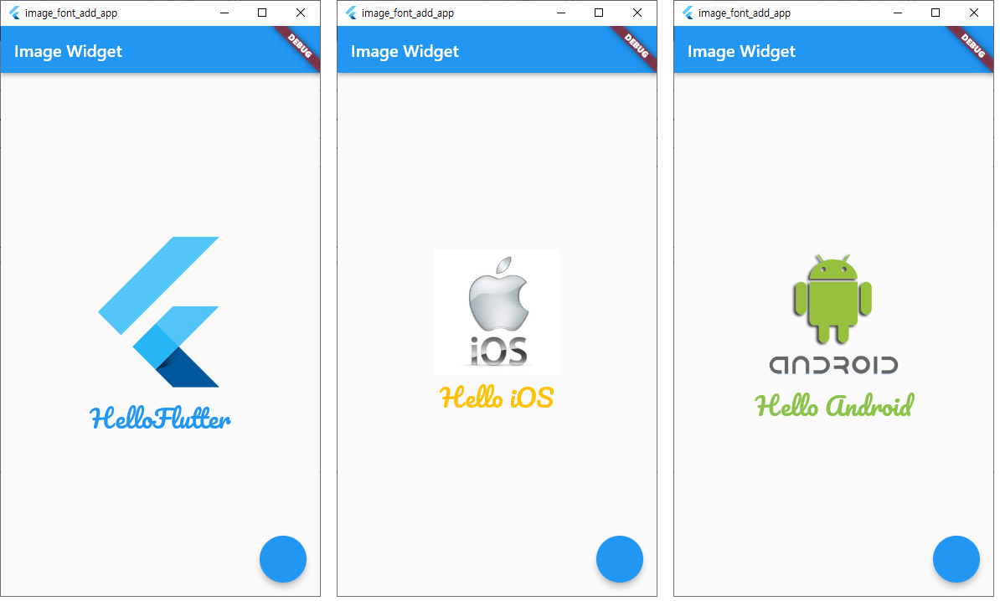
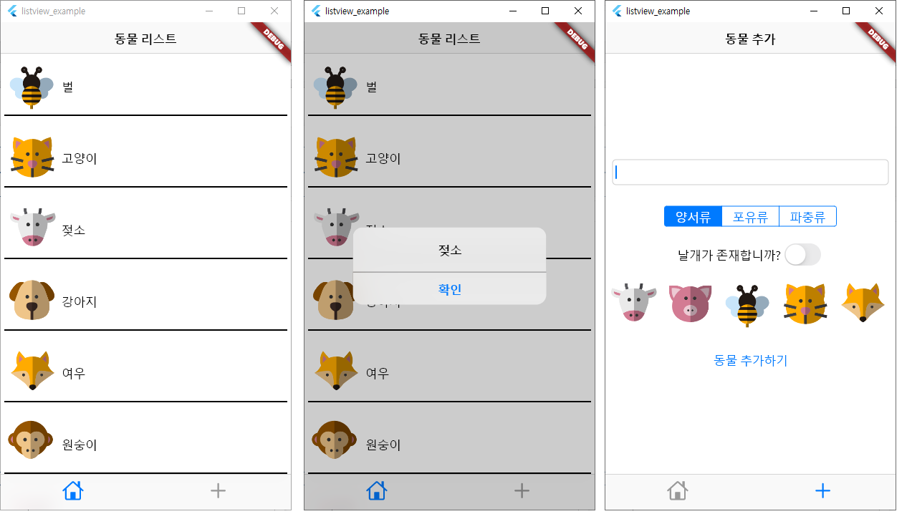
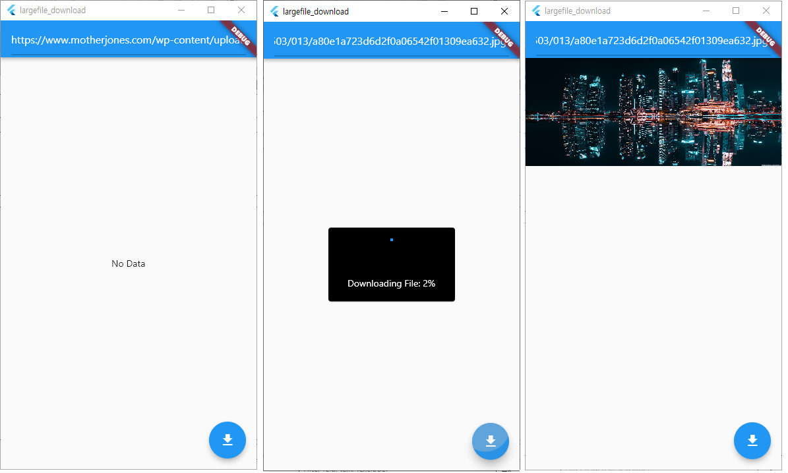
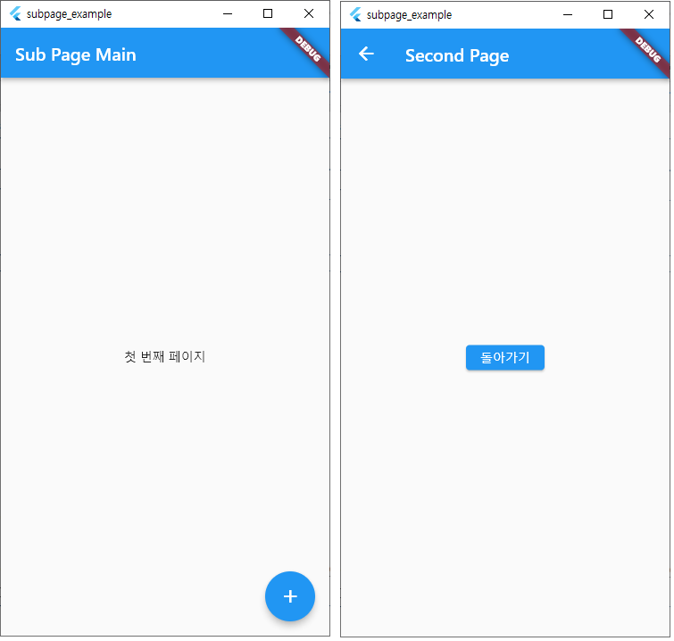

### [04] 플러터 위젯 사용법
 - 04-1 스캐폴드를 이용한 머티리얼 디자인 적용
 - 04-2 이미지와 폰트 추가하기
 - 04-3 사용자와 상호작용하는 앱 만들기
 
 - 실행화면
 

### [06] iOS 스타일로 플러터 앱 만들기
 - 06-1 쿠퍼티노 위젯으로 동물 소개 앱 만들기
 - 06-2 쿠퍼티노 위젯으로 동물 추가 화면 만들기
 - 06-3 그 밖의 쿠퍼티노 위젯 소개
 
 - 실행화면
 

### [07] 네트워크를 이용해 통신하기
 - 07-1 카카오 API를 이용해 책 정보 받아오기
 
 - 실행화면
 

### [07] 네트워크를 이용해 통신하기
 - 07-2 이미지 파일 내려받기

 - 실행화면
 

### [08] 내비게이션 활용하기
 - 08-1 내비게이션 이해하기
 - 08-2 할 일을 기록하는 앱 만들기
 
 - 실행화면
 
