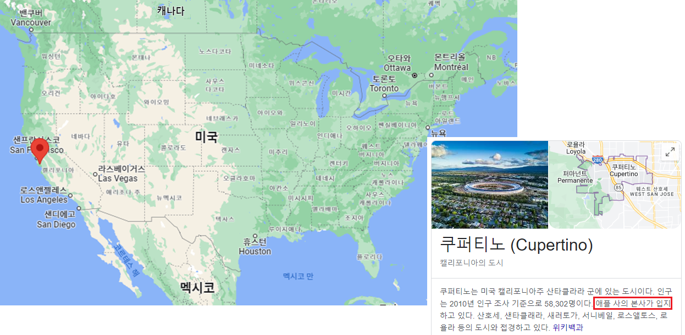
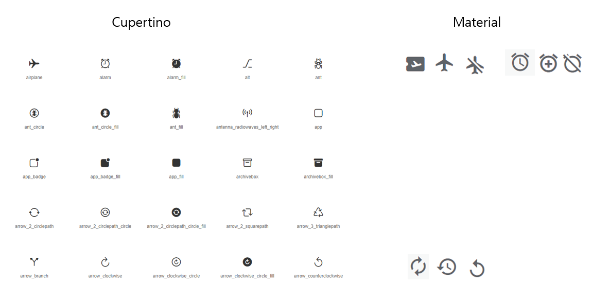
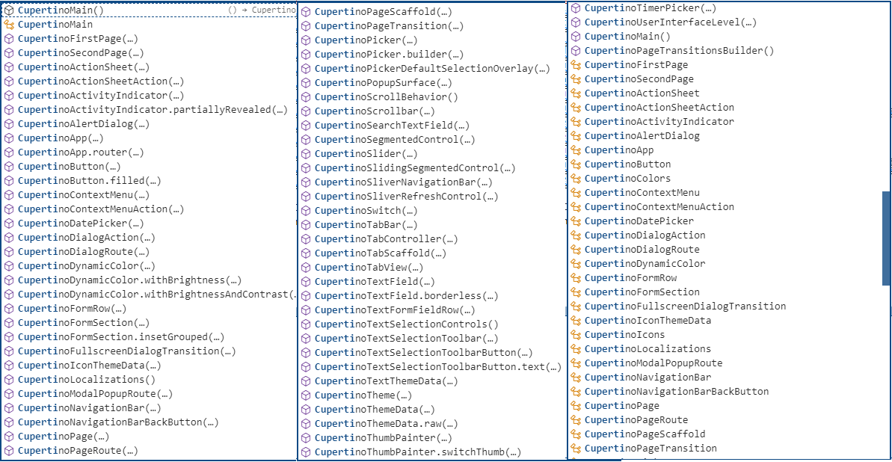
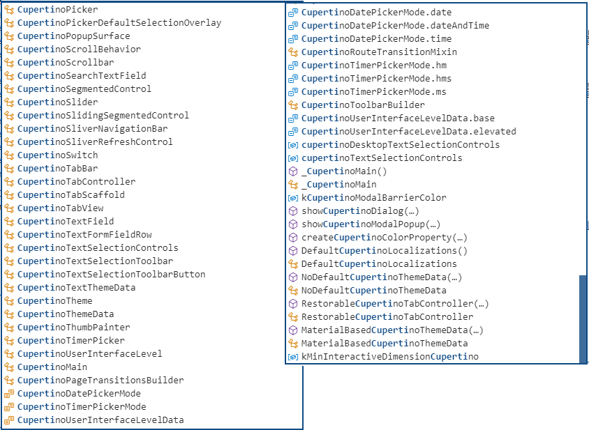
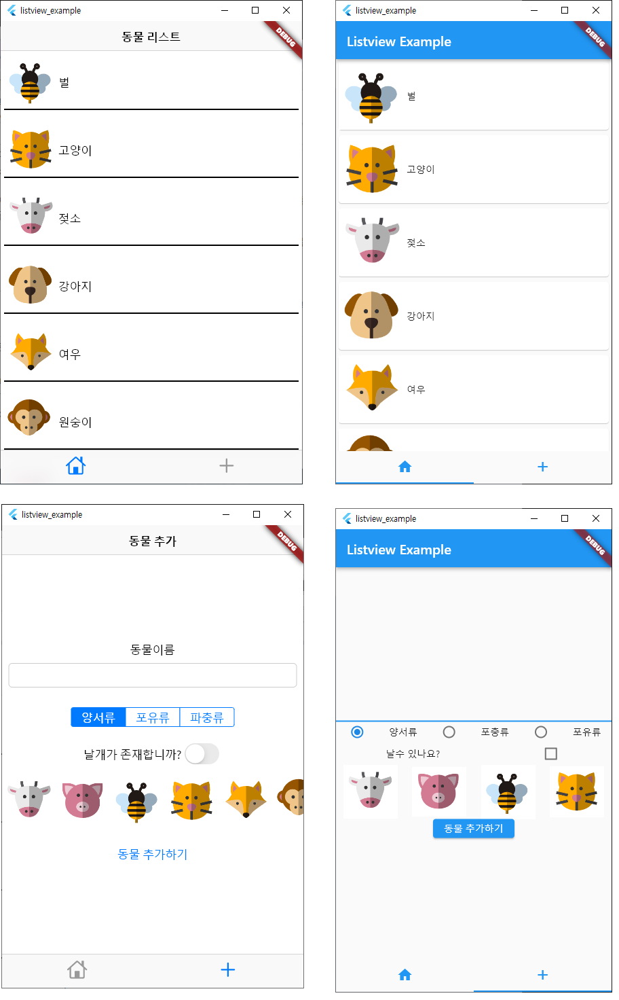
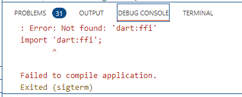
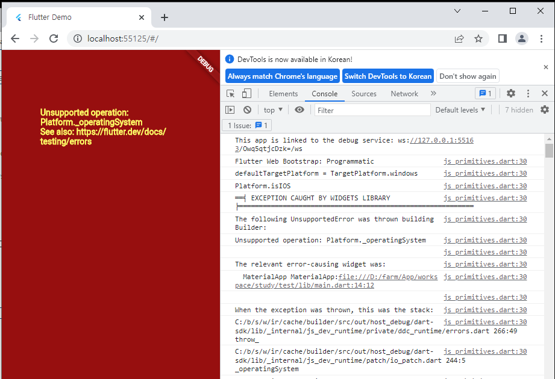
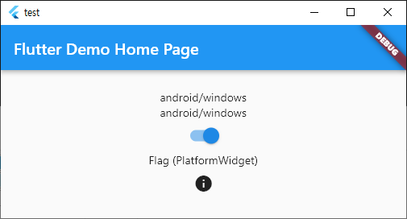

# 6장. iOS 스타일로 플러터 앱 만들기 (Cupertino)

> 잠시 쉬었다 갈께요.   
> 읍스 이럴수가(Flutter, 왜 선택하지 못했나) : https://engineering.linecorp.com/ko/blog/flutter-pros-and-cons/   
> (2019.8) (각종 Library버전이 v0. 대 라는거)   
> jobkrea : react(웹+앱) - 1,900건,  flutter : 302건 (2022.11.16일 기준)   
> 희망은 다시 시작된다. : https://d2.naver.com/helloworld/3384599     
> (2021.11)

## 1. Cupertino 명명


## 2. Cupertino 정의
#### 1. Material
 - Material 디자인은 Android에 적용하기 위해 Google이 만든 디자인 규칙이다
#### 2. Cupertino 
 - iPhone스러운 디자인을 적용하기 위해 Google에서 Cupertino 디자인팀이 만들었다.
#### 3. 왜?

## 3. Cupertino 분류
 - 1. Cupertino icon
 - 2. Cupertino widget
 - 3. Platform widget

## 4. Skia
#### 1. Skia 특징
 - Skia는 C++로 개발된 오픈 소스 2D 그래픽 라이브러리로 OpenGL의 Canvas를 사용해 렌더링을 한다. 
 - Skia는 2005년에 구글에 인수되었다.
 - Flutter는 Skia engine을 통해 Widget을 렌더링하고 제거한다
 - Flutter에서 Dart로 코드를 작성하면 안드로이드나 IOS의 컴포넌트들을 거치지 않고, 바로 화면을 렌더링 할 수 있다. 

#### 2. OpenGL
 - Skia가 Flutter의 그래픽 엔진으로 채택될 수 있었던 이유는 OpenGL을 사용하기 때문이다. 
 - OpenGL은 그래픽 라이브러리 중 하나로써, 대표적인 그래픽 라이브러리로는 DirectX, Metal, OpenCV 등이 있다. 
 - DirectX는 마이크로소프트에서 개발했고, 윈도우와 엑스박스 등에서 사용한다. 
 - Metal은 apple에서 개발한 라이브러리로 Mac, IOS에서 사용된다. 
 - OpenCV(Open Source Computer Vision Library)는 컴퓨터 비전 및 머신 러닝 라이브러리이다. 
 - 여러 플랫폼들에서 사용하는 얼굴 인식, 개체 감지, 이미지 검색 등의 기능들을 개발 할 때 사용되는 라이브러리이다.
 - 이 외에도 하이레벨 툴인 유니티나 언리얼 엔진, Prodcessing, 3D Max 등이 있다.

## 5. Cupertino icon
#### 1. Material icons
 - https://fonts.google.com/icons?selected=Material+Icons
```dart
   . style적용 후
   . download 2가지 (svg, png) type 으로 download가능
   . svg : SVG는 Scalable Vector Graphics라는 뜻인데, 번역하자면 확장가능한 벡터 그래픽이다. 
           픽셀을 이용하여 그림을 그리는 png jpg 파일들과 다르게 벡터를 기반으로 이미지를 표현한다. 
           그러다보니 크기를 조절함에 따라 깨지는 것이 없고, 
           용량이 작기 때문에 웹에서 자주 사용하는 이미지 형식이다.
   . png : Portable Network Graphics의 약자로 무손실압축 방식에 32비트 트루컬러 처리가 가능한 그래픽 형식이다.
   . Vector Graphics : 
      - 벡터 그래픽은 어떠한 명령만 있다. 
      - 예를 들어 Line(0, 0) to (10, 10)이라는 명령이 있다면  0,0의 좌표에서 10,10의 좌표까지 선을 그리는 것이다. 
      - 고정된 팩셀들로 이루어진 것이 아니라 '얼마 만큼 어느 방향으로'라는 식의
        좌표와 방향성을 띈 수학적 공식들로 이루어진 이미지이다.
      - 파워포인트의 기능에서 도형 그리기도 벡터 그래픽이다.

 - flutter에서 바로 사용가능 
```
#### 2. Cupertino icons
   - https://pub.dev/packages/cupertino_icons
   - https://api.flutter.dev/flutter/cupertino/CupertinoIcons-class.html#constants

#### 3. Cupertino icon Library 사용하기
```dart
 - pubspec.yaml
   cupertino_icons: ^1.0.2   : default로 추가되어져 있음 
```

#### 4. Material/Cupertino icons 비교


## 6. Cupertino Widget
#### 1. Cupertino Widget사용 시 import
```dart
  import 'package:flutter/cupertino.dart';
```

#### 2. Widget 목록
 - 현재 약 183개 존재 (Widget + Api)




#### 3. Widget 화면
 - Material Widget
 > https://docs.flutter.dev/development/ui/widgets/material

 - Cupertino Widget
 > https://docs.flutter.dev/development/ui/widgets/cupertino

## 7. 동물리스트 화면 비교해 보기
 - Android style .......... | ............... iOS Style


## 8. OS 구분 방법 - 네가지
#### 1. foundation.dart 사용
```dart
    import 'package:flutter/foundation.dart';

    //TargetPlatform.enum : android, fuchsia,iOS,linux,macOS,windows,
    if (defaultTargetPlatform == TargetPlatform.iOS) {
      //iOS
    } else if (defaultTargetPlatform == TargetPlatform.android) {
      //Android
    } else if (defaultTargetPlatform == TargetPlatform.windows) {
      //windows
    }
    
```
 - 아쉽게도 chrome, ie, Edge을 구분할 수 있는 기준은 없다.
 - os를 구분하는 api이고, browser를 구분하는 api는 아니기 때문이다.
 - chrome으로 실행 시 'windows'로 분류 된다.

 - 아래는 오류 발생????

 - import 자체가 되지 않는다.
 - 신규플젝을 만들어서 할 경우에는 다른 오류가 발생한다.


#### 2. dart:io 사용
```dart
    import 'dart:io' show Platform;

    //os 구분 : isAndroid, isFuchsia, isIOS, isLinux, isMacOS, isWindows
    if (Platform.isAndroid) {
      //iOS
    } else if (Platform.isIOS) {
      //Android
    } else if (Platform.isWindows) {
      //Windows
    }
```

#### 3. Theme.of(context) 사용
```dart
    import없이 바로 사용가능

    Theme.of(context).platform == TargetPlatform.iOS

    예제 소스는 아래에
```

#### 4. Flatform Widget이용하기
 - 다음 챕터에 내용 존재

#### 5. OS구분, 객체 변경 예제
```dart
  @override
  Widget build(BuildContext context) {
    return Scaffold(
      appBar: AppBar(
        title: Text(widget.title),
      ),
      body: Column(
        mainAxisAlignment: MainAxisAlignment.center,
        children: [

          // type 1
          defaultTargetPlatform == TargetPlatform.iOS ? const Text("ios") : const Text("android/windows"),

          // type 2
          Platform.isIOS ? const Text("ios") : const Text("android/windows"),

          // type 3
          Center(
            child: Theme.of(context).platform == TargetPlatform.iOS
                ? CupertinoSwitch(value: flag, onChanged: (bool value) {})
                : Switch(
                    value: flag,
                    onChanged: (bool value) {
                      setState(() { flag = value; });
                    },
                  ),
          ),

          //type 4
          PlatformWidget(
            cupertino: (context, platform) => const Icon(CupertinoIcons.flag),
            material: (_, __) => const Text("Flag (PlatformWidget)"),
          ),
          PlatformIconButton(
              onPressed: () => {},
              materialIcon: const Icon(Icons.info),
              cupertinoIcon: const Icon(CupertinoIcons.info),
              material: (_, __) => MaterialIconButtonData(tooltip: 'android 버튼'),  //icon mouse over시 tooltip
              cupertino: (_, __) => CupertinoIconButtonData(),          
          ),
        ],
      ),
    );
  }
```
 - 실행결과


## 9. Platform Widgets 들을 이용한 개발방법
#### 1. 정의
 - Flutter platfrom Widgets 라이브러리는 두 가지의 OS를 인식하며 각기 다른 UI를 제공할 수 있게 해 준다.

#### 1. Widget 종류
 - library : flutter_platform_widgets: ^2.0.0 
 - import  : import 'package:flutter_platform_widgets/flutter_platform_widgets.dart';
 - url : https://pub.dev/packages/flutter_platform_widgets

 - PlatformWidget
 - PlatformText
 - PlatformSwitch
 - PlatformSlider
 - PlatformTextField
 - PlatformButton
 - PlatformIconButton
 - PlatformApp
 - PlatformScaffold
 - PlatformTabScaffold
 - PlatformAppBar
 - PlatformNavBar
 - PlatformPopupMenu
 - PlatformAlertDialog
 - PlatformDialogAction
 - PlatformCircularProgressIndicator
 - PlatformPageRoute
 - PlatformPage
 - ShowPlatformModalSheet
 - ShowPlatformDatePicker
 - PlatformProvider
 - PlatformThemeData
 - PlatformIcons
 - PlatformWidgetBuilder
 
#### 2. PlatformWidget Widget
 - 플랫폼마다 다른 위젯을 보여주고 싶을 때 사용 하기에 적합하다.
 - 생성되는  widget이 정해지지 않았을 때 유용하게 사용.
```dart
  PlatformWidget({
      Key? key,
      this.cupertino,
      this.material,
    }) : super(key: key);
  ============================================
  return PlatformWidget(
    cupertino: (_, __) => Icon(CupertinoIcons.flag),
    material: (_, __)  => Icon(Icons.flag),
  );
```

#### 3. PlatformApp Widget
 - Material에서 MaterialApp을 사용하거나 Cupertino에서 CupertinoApp을 사용하기 위한 최상위 위젯이다.
 - Android, iOS에서 각각 다른 Theme을 원할 경우 아래의 코드처럼 MaterialAppData,    
   CupertinoAppData에서 Theme의 값을 입력하면 깔끔하게 코드를 작성할 수 있다.
 - PlatformApp에서 Home은 공통으로 사용하고 Android,iOS Theme을 따로 설정하는것이 맞는거 같다.

```dart
  return PlatformApp(
    title: 'Flutter Demo',
    home: MyHomePage(),
    material: (_, __) => MaterialAppData(
      home: MyHomePage(),
      theme: ThemeData(
        textTheme: TextTheme(
          headline1: TextStyle(color: Colors.indigo), // headline1 스타일 값을 지정
        ),
      ),
    ),
    cupertino: (_, __) => CupertinoAppData(
      home: MyHomePage(),
      theme: CupertinoThemeData(
          primaryColor: Color(0xff127EFB),
          textTheme: CupertinoTextThemeData(
              textStyle: TextStyle(color: Colors.red))),
    ),
  );
  ============================================
  MaterialAppBarData _materialAppBar() => MaterialAppBarData(
        title: Text(
          'Material AppBar',
          style: Theme.of(context).textTheme.headline1, // 위에서 지정한 디자인 적용
        ),
      );
```

#### 4. PlatformWidgetBuilder Widget
 - 플랫폼마다 다른 위젯을 설정할 수 있다.
 - child에 입력된 Container(~) 위젯을 각 플랫폼에서 사용할 수가 있다.
 - 공통된 위젯을 사용할 거면 child 인자를 받아서 사용해도 되고 수정해서 사용할꺼면 플랫폼마다 다른 child에 위젯을 넣어서 사용하면 된다.

```dart
  PlatformWidgetBuilder(
    cupertino: (_, child, __) => GestureDetector(child: child, onTap: _handleTap),
    material: (_, child, __) => IniWell(child: child, onTap: _handleTap),
    child: Container(child: Text('Common text')),
  );
```

#### 5. PlatformThemeData Widget
 - Flutter에서 제공하는 기본적인 위젯에서 플랫폼별로 다른 스타일을 적용하고 싶을 때 사용하기 적합하다.

```dart
  Text(
    platform.text,
    textAlign: TextAlign.center,
    style: platformThemeData(
      context,
      material: (data) => data.textTheme.headline5,
      cupertino: (data) => data.textTheme.navTitleTextStyle,
    ),
)
```

#### 6. PlatformThemeData Widget
```dart
  PlatformIconButton(
      onPressed: () => {},
      materialIcon: const Icon(Icons.info),
      cupertinoIcon: const Icon(CupertinoIcons.info),
      material: (_, __) => MaterialIconButtonData(tooltip: 'android 버튼'),  //icon mouse over시 tooltip
      cupertino: (_, __) => CupertinoIconButtonData(),
  )
```
