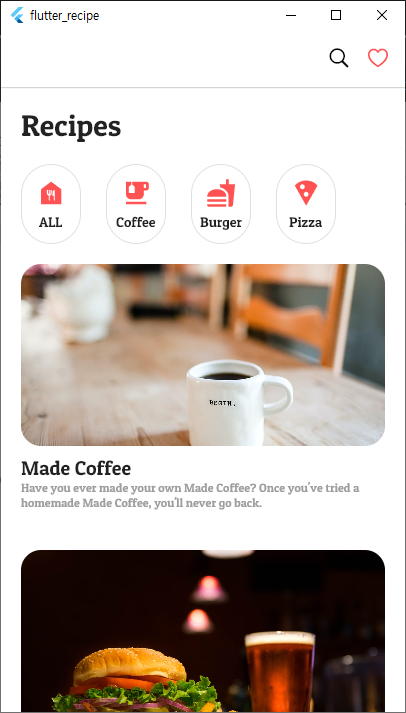
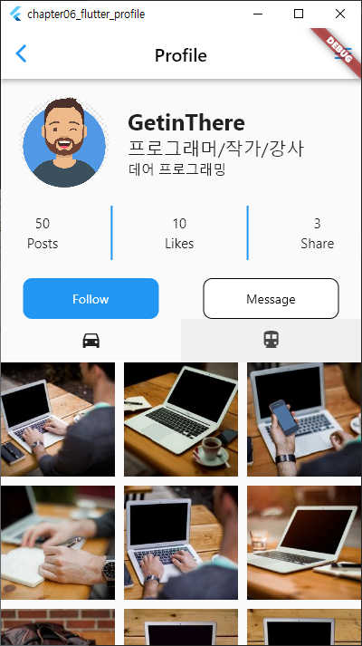
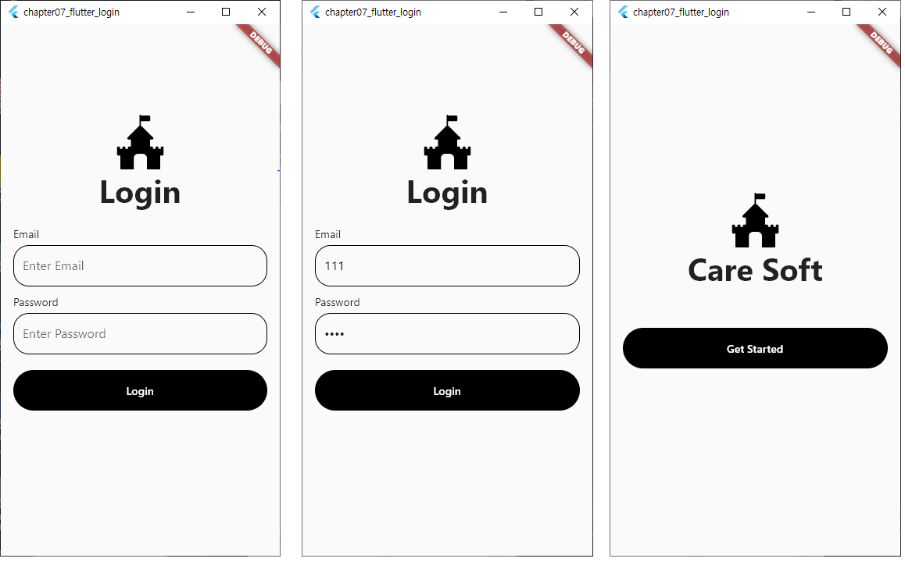
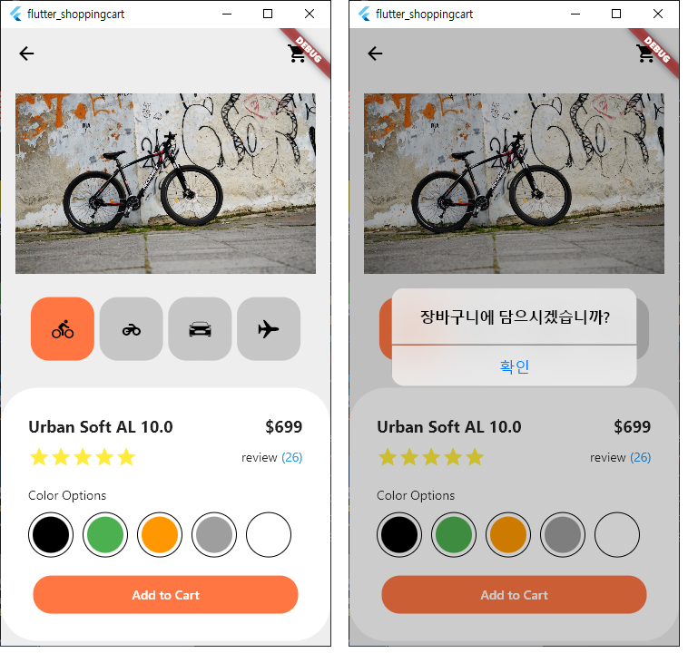
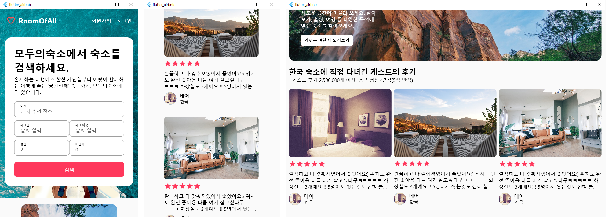
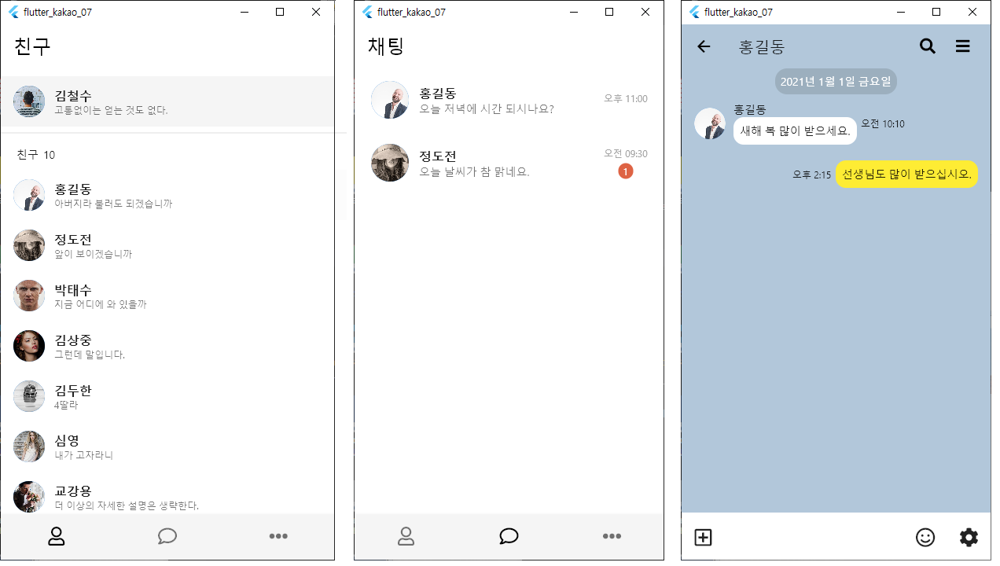

# 플러터 UI 1권
- Flutter 3.3.6 잘 실행됨 (2022.11.06)

### 1장 플러터란
 - 소스 코드 없음

### 2장 플러터 시작하기
- 소스 코드 없음

### 3장 다트 언어
- 소스 코드 없음

### 4장 플러터 위젯 - 스토어 앱 만들기
- flutter_store
 

### 5장 플러터 위젯 - 레시피 앱 만들기
- flutter_recipe

### 6장 플러터 위젯 - 프로필 앱 만들기
- flutter_profile

### 7장 플러터 위젯 - 로그인 앱 만들기
- flutter_login

### 8장 플러터 위젯 - 쇼핑카트 앱 만들기
- flutter_shoppingcart

### 9장 플러터2.0 - 모두의숙소 웹 만들기
- flutter_airbnb
- 화면 width에 따라서 후기가 가로로 여러게 보여짐

### 10장 모두의채팅 UI 만들어보기
- flutter_kakao_01
- 7개 플젝으로 나누워져 있음. 1번부터 7번까지 step을 나누워서 구성. 7번째가 모두 합해져서 보여지고 있음  

### 샘플 assets 모음
- 프로젝트에 필요한 모든 이미지, 폰트, 로고를 모아둔 폴더